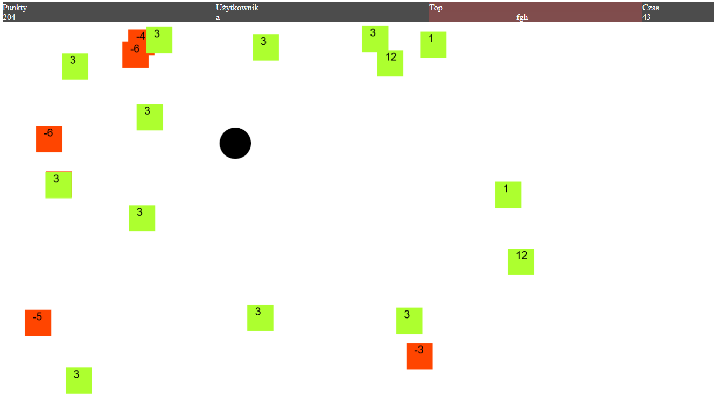

# Squar game

## Describe
* You move the ball and try to hitsquares. Each squars has his points - value. 
Time is running out and the square value decreases, if the square value is less than -20, 
the square will be removed and a new square will be created.

* The game has three levels. After you complete level,
the ball's speed is growing, time run faster and the squars value less faster.
## Controls
* UP - ball direction  was change to up
* DOWN - ball direction  was change to down
* LEFT - ball direction  was change to left
* RIGHT - ball direction  was change to right
## How start game
* Firstly you must write yours login
* Secondly you must set ball speed 1-10, recomendly 3
* Thirdly  you must set numbers of squars, recomendly 20
